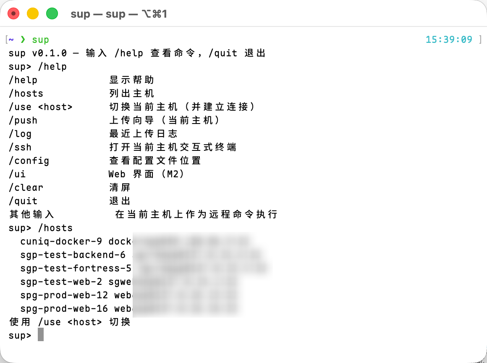
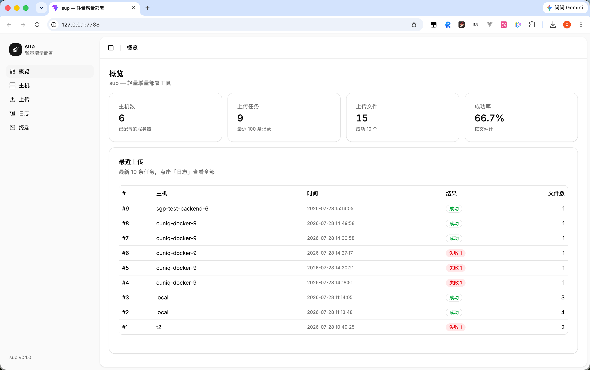
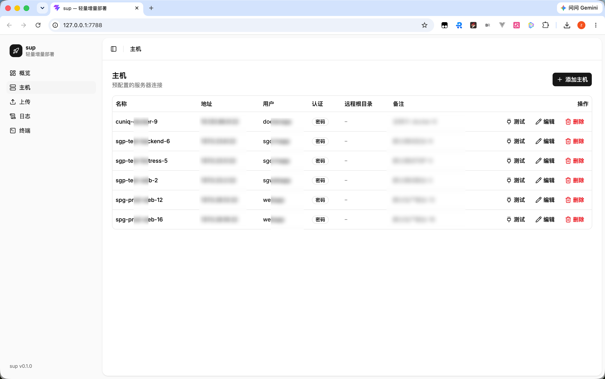
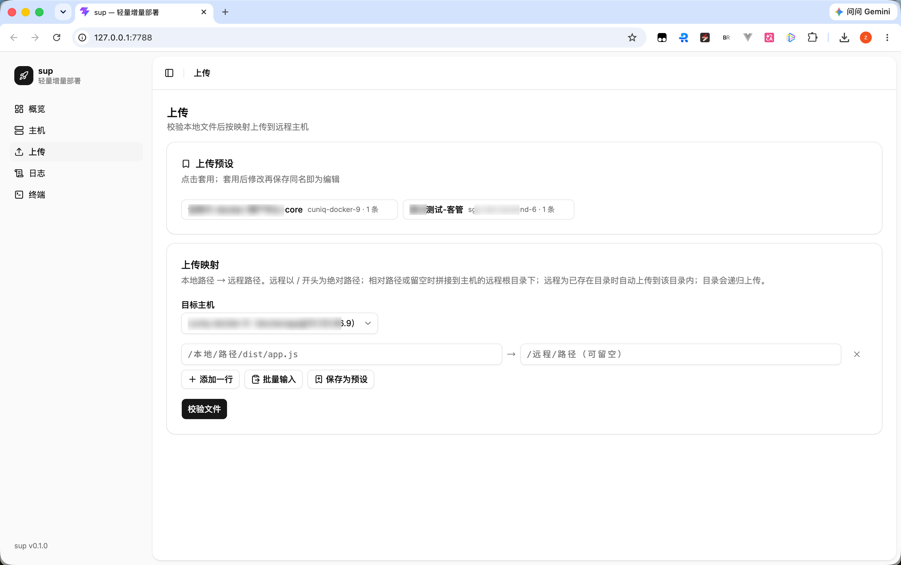
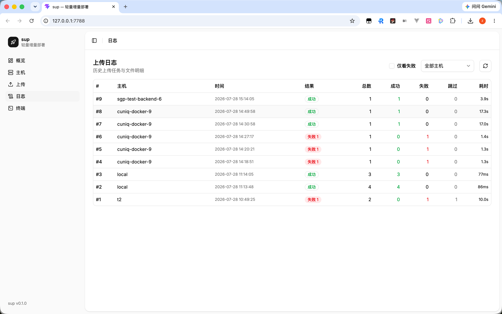
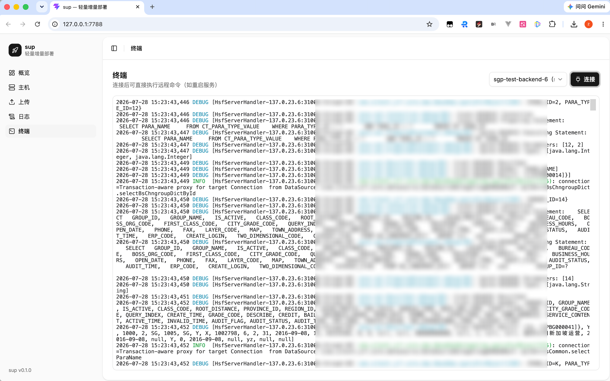

# sup

轻量级远程增量部署工具，为无法整包发布的老项目而生。

改了几个文件就要登服务器逐个上传？`sup` 帮你把这件事变成一条命令：预配置主机 → 校验本地文件（缺失标红剔除）→ 并发 SFTP 上传（进度条）→ 自动记录日志，还内置远程终端，传完顺手重启服务，不用切换应用。

- 单二进制（约 10 MB，内嵌 Web 界面 + AI 服务），运行只需 Node.js ≥ 20
- macOS 优先支持；密码/AI API Key 存系统钥匙串，不落盘
- 三种用法：子命令、交互式 REPL、Web 图形界面
- AI 主机巡检与诊断（可选，需 Node.js ≥ 20）
- 可视化远程文件编辑器 + 审批工作流

## 效果预览

| CLI                 | Web 概览              |
| ------------------- | --------------------- |
|  |  |

| 主机管理               | 文件上传                |
| ---------------------- | ----------------------- |
|  |  |

| 上传日志              | 远程终端                  |
| --------------------- | ------------------------- |
|  |  |

## 安装与构建

### 方式一：从 Release 下载（推荐）

前往 [Releases](https://github.com/yn-zxj/sup/releases) 下载对应平台的产物，解压后直接使用：

```bash
tar -xzf sup-*.tar.gz
sudo mv sup /usr/local/bin/
sup --help
```

> macOS 首次运行若提示无法验证开发者，执行 `xattr -d com.apple.quarantine /usr/local/bin/sup` 后重试。

### 方式二：本地构建

依赖：Rust（stable）、Node.js ≥ 20（构建前端 + 可选 AI 服务）。

```bash
# 1. 构建 Web 前端
cd web && npm install && npm run build && cd ..

# 2. （可选）构建 AI 服务为单文件 bundle（使用 tsup 打包，产物嵌入二进制）
cd ai && npm install && npm run bundle && cd ..

# 3. 构建发布版（web/dist 和 ai/dist 会嵌入二进制）
cargo build --release

# 4. （可选）安装到 PATH
cp target/release/sup /usr/local/bin/
```

## 快速开始

```bash
# 1. 添加主机（会提示输入密码，保存到系统钥匙串）
sup host add prod --host 10.0.0.8 --user root --remote-root /var/www/app

# 2. 测试连接
sup host test prod

# 3. 上传（改了哪些传哪些）
sup push prod --map dist/app.js:/var/www/app/dist/app.js --map dist/main.css:/var/www/app/dist/main.css

# 4. 传完开个终端重启服务
sup ssh prod
```

## CLI 命令

### 主机管理 `sup host`

```bash
sup host add <name> --host <ip> --user <user> [--port 22] [--key ~/.ssh/id_rsa] [--remote-root /var/www/app] [--note 备注]
sup host list          # 列出所有主机
sup host edit <name>   # 修改配置
sup host rm <name>     # 删除主机及钥匙串凭据
sup host test <name>   # 测试连接
```

不带 `--key` 时使用密码认证，首次连接会提示输入并保存到钥匙串。

### 上传 `sup push`

```bash
sup push <host> --map 本地:远程 [--map ...]     # 显式指定远程路径
sup push <host> --map dist/app.js              # 远程留空，按主机 remote_root 拼接
sup push <host> --map dist:/var/www/app/dist   # 目录会递归上传
sup push <host> --from-file files.txt          # 从清单文件批量读取
```

| 选项                  | 说明                                                  |
| --------------------- | ----------------------------------------------------- |
| `--map 本地:远程`     | 路径映射，可重复；只写本地路径时按 `remote_root` 拼接 |
| `--from-file <file>`  | 清单文件，每行一条映射，`#` 开头为注释                |
| `--remote-root <dir>` | 覆盖主机配置的远程根目录                              |
| `-y, --yes`           | 缺失文件自动剔除，不询问                              |
| `--concurrency <n>`   | 并发连接数（默认 4）                                  |
| `--retry <n>`         | 单文件失败重试次数（默认 2）                          |

上传流程：校验本地文件存在性 → 缺失的标红列出并询问是否剔除 → 并发上传（自动创建远程目录，实时进度条）→ 汇总并写入日志。

### 远程终端 `sup ssh`

```bash
sup ssh <host>    # 打开交互式 PTY 终端（支持 vim、top 等全屏程序）
```

### 上传日志 `sup log`

```bash
sup log list [--host prod] [--failed] [--limit 20]   # 任务列表
sup log show <task_id>                               # 单任务文件明细（成功/失败/剔除、耗时、错误原因）
```

## 交互式 REPL

直接运行 `sup`（不带子命令）进入 REPL，风格类似 AI CLI 工具：

```
sup> /use prod          # 连接主机，之后提示符变为 sup(prod)>
sup(prod)> /push        # 交互式上传向导
sup(prod)> systemctl restart app    # 非 / 开头的输入直接作为远程命令执行
```

| 命令            | 说明                               |
| --------------- | ---------------------------------- |
| `/help`         | 帮助                               |
| `/hosts`        | 列出主机                           |
| `/use <name>`   | 连接主机                           |
| `/push`         | 上传向导（逐行输入映射，空行结束） |
| `/ssh`          | 进入完整 PTY 终端                  |
| `/log`          | 查看上传日志                       |
| `/config`       | 显示配置文件位置                   |
| `/ui`           | 启动 Web 界面                      |
| `/clear`        | 清屏                               |
| `/quit` `/exit` | 退出                               |

## Web 界面

```bash
sup ui              # 默认 http://127.0.0.1:7788，自动打开浏览器
sup ui --port 8080  # 指定端口
```

shadcn/ui 风格的图形界面（仅监听本机回环地址），包含六个页面：

- **概览**：主机数、任务数、成功率统计与最近上传
- **主机**：表格管理，支持添加/编辑/删除/测试连接，**一键导出/导入**主机配置
- **上传**：
  - 逐行填写或「批量输入」粘贴多行一次解析（支持 `本地:远程`、`本地 -> 远程`、仅本地路径三种格式）
  - 校验 → 缺失文件标红提示剔除 → 上传进度条实时刷新
  - **上传预设**：把常用的"固定文件传固定位置"（如项目 jar 包 → 服务器部署目录）保存为带名称的预设，下次一键套用；同名保存即编辑，悬停可删除
- **日志**：任务列表 + 文件明细抽屉，可按主机/失败过滤
- **终端**：浏览器内的完整远程终端（xterm.js + WebSocket，浅色主题），连接主机后可打开 **AI 助手面板**进行巡检诊断
- **文件编辑**：可视化远程文件编辑器（Monaco Editor），左侧文件树浏览 + 右侧语法高亮编辑 + Ctrl+S 保存

## 配置与数据

| 路径                           | 内容                      |
| ------------------------------ | ------------------------- |
| `~/.config/sup/hosts.toml`     | 主机配置（不含密码）      |
| `~/.config/sup/presets.toml`   | 上传预设                  |
| `~/.config/sup/ai.toml`        | AI 大模型配置（不含 Key） |
| `~/.config/sup/sup.db`         | 上传日志（SQLite）        |
| 系统钥匙串（服务名 `sup-cli`） | 密码 / 私钥口令 / AI Key  |

## AI 大模型配置（可选）

在 Web 界面「终端」→「AI 助手」面板中点击 ⚙️ 图标，即可图形化配置大模型：

- 支持 OpenAI / DeepSeek / 通义千问 / 智谱 GLM / Moonshot 等兼容接口
- API Key 加密存储在系统钥匙串，不落磁盘
- 也可以手动创建 `~/.config/sup/ai.toml`：

```toml
enabled = true
provider = "openai"
base_url = "https://api.openai.com/v1"
model = "gpt-4o"
port = 7799
```

启动 sup 后会自动 spawn AI 服务进程（端口 7799），无需手动管理。AI 服务已内嵌在二进制中，不需要额外的 `ai/` 目录或 `node_modules`。

AI 功能包括：
- **一键巡检**："巡检主机" → 自动收集 CPU / 内存 / 磁盘 / 网络 / 进程指标
- **智能诊断**：提问主机状态，AI 自动执行命令并分析输出
- **审批工作流**：`rm -rf`、`shutdown` 等危险命令会弹窗要求人工确认，30s 超时自动拒绝

## 发布

推送 `v*` 标签即触发 GitHub Actions 流水线（`.github/workflows/release.yml`），自动完成前端编译 → Rust 交叉构建 → 产物上传到 Release，无需本地编译：

```bash
git tag v0.1.0
git push origin v0.1.0
```

流水线产物覆盖三个平台：

| 产物                                  | 平台                  |
| ------------------------------------- | --------------------- |
| `sup-aarch64-apple-darwin.tar.gz`     | macOS (Apple Silicon) |
| `sup-x86_64-apple-darwin.tar.gz`      | macOS (Intel)         |
| `sup-x86_64-unknown-linux-gnu.tar.gz` | Linux (x86_64)        |

本地构建发布版：

```bash
cd web && npm run build && cd ..
cargo build --release
# 产物：target/release/sup（单文件，直接分发即可）
```

release 配置已开启 LTO、strip、`opt-level = "z"`，二进制约 10 MB（含内嵌前端 + AI 服务）。

## 技术栈

| 层          | 技术                                                                         |
| ----------- | ---------------------------------------------------------------------------- |
| CLI / 后端  | Rust（clap / ssh2 / axum / rusqlite / keyring / reqwest）                    |
| Web 前端    | React + TypeScript（Vite / Tailwind v4 / shadcn/ui / xterm.js / Monaco）     |
| AI 服务     | Node.js + TypeScript（Express / @langchain/core / @langchain/openai / LangGraph，经 tsup 打包嵌入二进制） |

前端产物经 rust-embed 打进二进制，AI 服务以独立子进程运行。
